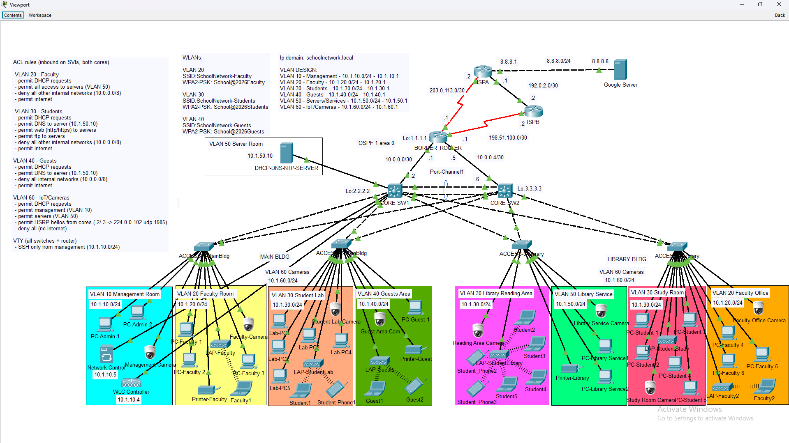

# School Campus Network (Cisco Packet Tracer)

A two-building school network designed, built and troubleshot end to end in Cisco Packet Tracer: redundant Layer 3 cores, six segmented VLANs, OSPF, a dual-ISP Internet edge with NAT failover, controller-based wireless and layered access security.

**Author:** Chester Evio · CCNA
**Tools:** Cisco Packet Tracer · IOS / IOS-XE CLI



## At a glance

| Area | What is implemented |
|---|---|
| Switching | 2 Layer 3 cores, 4 access switches, Rapid PVST+, PAgP EtherChannel between the cores, VTP |
| Redundancy | HSRPv2 split across the cores (active/active per VLAN), STP roots aligned with HSRP, every access switch dual-homed |
| Routing | Single-area OSPF, routed links to the border router, default route injected from the edge |
| Internet edge | Dual ISP with a floating static backup, PAT to one public address that both ISPs route |
| Wireless | WLC 3504 with 6 lightweight APs in FlexConnect mode, 3 WLANs, AP groups per building |
| Security | Per-VLAN ACLs (least privilege), SSH limited to the management VLAN, port security, DHCP snooping, BPDU guard, parked unused ports |
| Services | DHCP (relayed), DNS, authenticated NTP |

## Devices

| Role | Model | Qty |
|---|---|---|
| Core / distribution | Catalyst 3650 | 2 |
| Access | Catalyst 2960 | 4 |
| Border router | ISR 4331 + NIM-2T | 1 |
| Wireless controller | WLC 3504 | 1 |
| Lightweight AP | LAP-PT | 6 |
| DHCP / DNS / NTP server | Server-PT | 1 |
| Simulated Internet | 2 ISP routers + 1 external server | 3 |

## VLANs and addressing

| VLAN | Name | Subnet | Gateway (HSRP) | HSRP active / STP root |
|---|---|---|---|---|
| 10 | Management | 10.1.10.0/24 | 10.1.10.1 | CORE_SW1 |
| 20 | Faculty | 10.1.20.0/24 | 10.1.20.1 | CORE_SW1 |
| 30 | Students | 10.1.30.0/24 | 10.1.30.1 | CORE_SW1 |
| 40 | Guests | 10.1.40.0/24 | 10.1.40.1 | CORE_SW2 |
| 50 | Servers | 10.1.50.0/24 | 10.1.50.1 | CORE_SW2 |
| 60 | IoT / cameras | 10.1.60.0/24 | 10.1.60.1 | CORE_SW2 |
| 999 | Parking (unused ports) | none | none | none |

Trunks between switches use an unused native VLAN (111).

| Link | Subnet |
|---|---|
| CORE_SW1 to border router | 10.0.0.0/30 |
| CORE_SW2 to border router | 10.0.0.4/30 |
| Border router to ISPA (primary) | 203.0.113.0/30 |
| Border router to ISPB (backup) | 198.51.100.0/30 |
| ISPA to ISPB peering | 192.0.2.0/30 |
| School public NAT block | 203.0.113.16/29 |

Public addressing uses the RFC 5737 documentation ranges.

## Access policy

Extended ACLs are applied inbound on the VLAN interfaces of both cores.

| From \ To | Mgmt | Faculty | Students | Guests | Servers | IoT | Internet |
|---|---|---|---|---|---|---|---|
| Faculty | no | n/a | no | no | all | no | yes |
| Students | no | no | n/a | no | DNS, web, FTP | no | yes |
| Guests | no | no | no | n/a | DNS only | no | yes |
| IoT | yes | no | no | no | all | n/a | no |

SSH to every switch and the border router is accepted only from the management VLAN.

## Design decisions

- **HSRP and STP aligned per VLAN.** Each core is HSRP active and STP root for three VLANs, so traffic takes the direct path and both cores carry load.
- **Routed uplinks, not a shared VLAN, to the edge.** Internet-bound traffic never crosses the management VLAN.
- **OSPF passive by default.** Hellos are sent only on the border uplinks and one core-to-core adjacency, so user VLANs cannot form neighbors or inject routes.
- **One public NAT address routed by both ISPs.** The public IP stays the same during ISP failover, so return traffic always has a path. This stands in for what BGP would do in production.
- **FlexConnect local switching.** APs place client traffic directly onto the correct VLAN at their trunk port, so wireless users get the same ACLs and DHCP as wired users.
- **One deny rule per ACL for all internal space (10.0.0.0/8).** New VLANs are blocked by default.

More detail: [docs/design-decisions.md](docs/design-decisions.md)

## Troubleshooting highlights

Problems found and fixed during the build. Full write-up: [docs/troubleshooting.md](docs/troubleshooting.md)

| Symptom | Root cause | Fix |
|---|---|---|
| Network-wide STP instability after connecting the WLC | Controller reflected BPDUs back to the switch (caught by BPDU guard) | BPDU filter on the single-homed controller port |
| Both cores HSRP active for VLAN 60 | ACL ending in `deny ip any any` dropped HSRP hellos on the SVI | Permit HSRP between the two core SVI addresses |
| EtherChannel members suspended | Port-channel and member trunk settings did not match | Rebuilt the bundle, configuring the port-channel after joining clean members |
| Wireless clients not getting addresses in their VLAN | Simulator's controller does not tag client VLANs | FlexConnect local switching with trunked AP ports |
| NTP never synchronised | Server clock held local time instead of UTC | Server set to UTC, devices convert with `clock timezone` |

## Verification

| Test | Result |
|---|---|
| Wired and wireless clients receive DHCP addresses in the correct VLAN | Pass |
| All user VLANs reach the external server (8.8.8.8) through NAT | Pass |
| Primary ISP link shut: traffic fails over to ISPB with the same public IP | Pass |
| Students and guests cannot reach management, faculty or IoT | Pass |
| IoT devices cannot reach the Internet | Pass |
| SSH from a student PC to a core switch is refused | Pass |
| HSRP shows one active and one standby router for every VLAN | Pass |

Screenshots are in [verification/](verification/).

## Known limitations and next steps

- **Single border router and single WLC.** Next step: a second edge router with HSRP, and a controller HA pair.
- **No stateful firewall.** ACLs are stateless. A firewall at the edge and in front of the server VLAN is the natural next addition.
- **Library staff devices share the server VLAN (50),** which has no inbound ACL. They should move to the faculty VLAN or a dedicated one.
- **ISP failover detects link failure only.** IP SLA with object tracking would also catch an upstream outage.
- **VTP version 1 without a password.** Production would use a VTP password or transparent mode.
- **Simulator constraints:** the WLC cannot use NTP and sends management traffic untagged, so its switch port uses native VLAN 10.

## Repository layout

```
configs/        Clean configuration per device, plus WLC and server settings
docs/           Design decisions and troubleshooting log
topology/       Logical and physical topology screenshots
verification/   Show-command and test screenshots
School_Network.pkt
```

## Credentials

Configuration files use placeholders (`<ADMIN_SECRET>`, `<NTP_KEY>`, WLAN keys). Passwords stored inside the `.pkt` file are lab-only values and are not used anywhere else. In production, device access would use AAA (TACACS+ or RADIUS).
